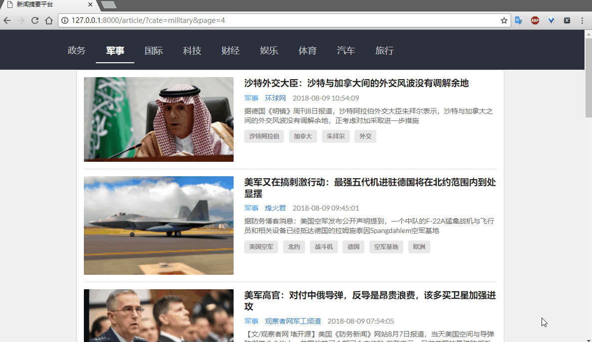
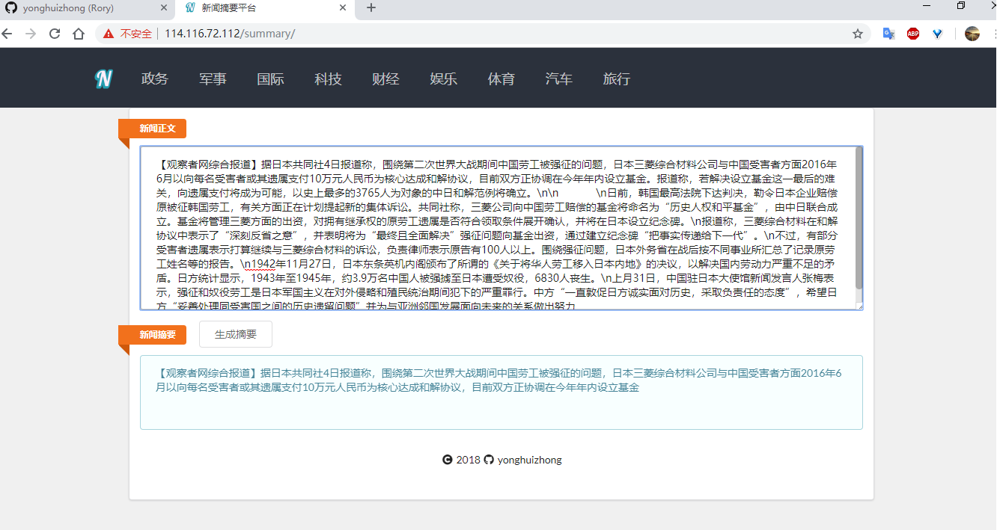
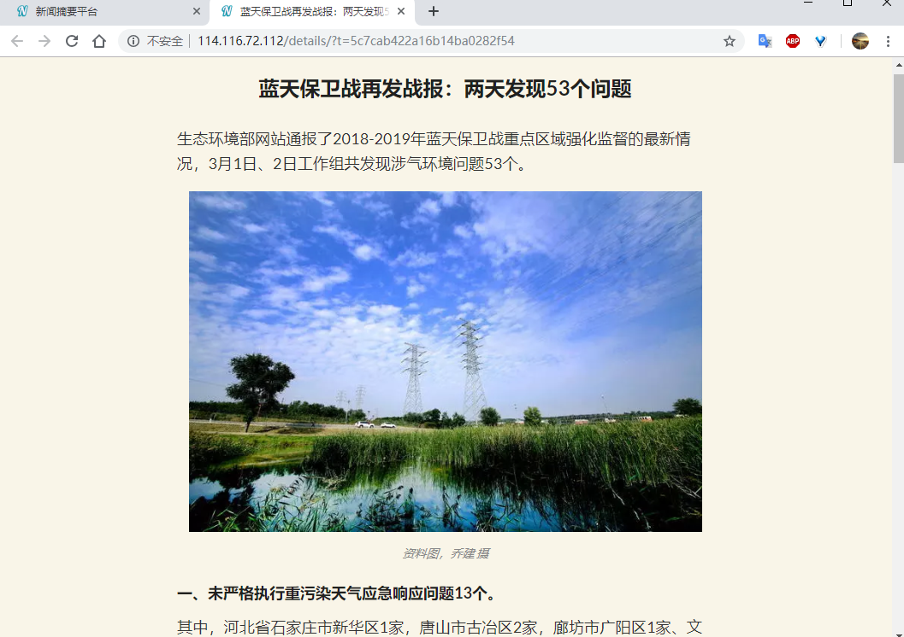

新闻摘要平台
------
1. [新闻爬取](https://github.com/yonghuizhong/newsqq)：使用Scrapy框架爬取、MongoDB存储数据
2. [摘要生成](https://github.com/yonghuizhong/newsSummary)：基于TextRank算法的中文摘要生成
3. [摘要展示](https://github.com/yonghuizhong/newsQQDjango)：后端为Django框架、前端使用Semantic UI、数据库为MongoDB 
```plain
网站已部署，在手机、平板、电脑浏览器上展示正常；新闻内容每天更新    
```
#### 主界面展示：  
  

#### 摘要生成页面：  
  

#### 新闻正文页面：  

